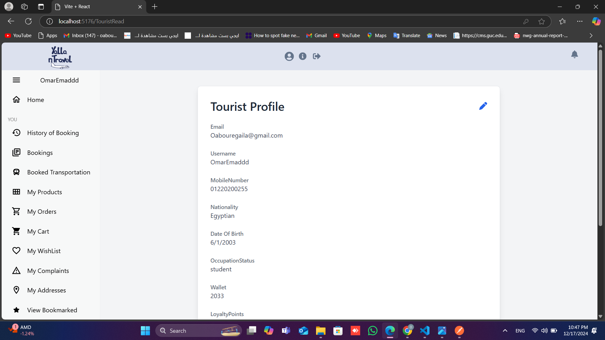

# Yala-n-Travel

Yala-n-Travel is a sophisticated travel management platform designed to streamline the process of planning, organizing, and managing travel itineraries and activities. Our application offers a comprehensive suite of features to enhance the travel experience for users, ensuring seamless and efficient travel planning.

## Motivation

The motivation behind Yala-n-Travel is to simplify the travel planning process and provide users with a comprehensive tool to manage their travel itineraries, bookings, and activities. We aim to enhance the travel experience by offering a user-friendly platform that caters to all travel needs in one place.

## Build Status

The current build status of Yala-n-Travel is stable. However, we are continuously working on improving the platform and addressing any bugs or issues that arise. If you encounter any issues, please report them, and we will address them promptly.

## Code Style

We adhere to the StandardJS code style for JavaScript
## Screenshots




## Tech/Framework Used

- **Frontend**: React, Redux
- **Backend**: Node.js, Express
- **Database**: MongoDB
- **Authentication**: JWT
- **Payment Gateway**: Stripe
- **Maps**: Google Maps API

## Features

- **User Authentication**: Secure and robust user registration and login system.
- **Ticket Booking**: Effortless booking of tickets for various modes of travel.
- **Itinerary Management**: Intuitive interface for creating and managing detailed travel itineraries.
- **Activity Scheduling**: Schedule and manage activities with ease during your travels.
- **Notifications**: Timely reminders and notifications for upcoming events and activities.
- **Search and Filter**: Advanced search and filtering options for travel plans and activities.
- **Responsive Design**: Fully responsive design for optimal use on both desktop and mobile devices.
- **User Profiles**: Manage user profiles with personal information and travel preferences.
- **Payment Integration**: Secure payment gateway integration for booking and other transactions.
- **Multi-language Support**: Support for multiple languages to cater to a global audience.
- **Travel Recommendations**: Personalized travel recommendations based on user preferences and history.
- **Social Sharing**: Share travel plans and experiences on social media platforms.
- **Review and Ratings**: Users can review and rate travel services and experiences.
- **Customer Support**: Integrated customer support for resolving user queries and issues.
- **Offline Access**: Access itineraries and travel information offline.
- **Map Integration**: Interactive maps for visualizing travel routes and destinations.
- **Currency Converter**: Built-in currency converter for international travel.
- **Travel Insurance**: Option to purchase travel insurance during booking.
- **Loyalty Program**: Earn and redeem points through a loyalty program for frequent travelers.
- **Admin Dashboard**: Comprehensive admin dashboard for managing users, bookings, and content.
- **Profile Management**: Users can update their personal information.
- **Flight Booking**: Integration with flight booking services for direct flight bookings.
- **Hotel Booking**: Integration with hotel booking services for accommodation bookings.
- **Activity Booking**: Users can book activities and tours at their destination.
- **Favorites**: Users can save their favorite destinations, hotels, and activities.
- **Share Itineraries**: Users can share their itineraries with friends and family.
- **Booking History**: Users can view their past bookings and itineraries.
- **Notifications**: Users receive notifications for booking confirmations, reminders, and special offers.
- **Emails**:Users recieve Emails for confirmations and reminders
- **API Integration**: Integration with third-party APIs for additional services.
-**User-Friendly Interface**: Intuitive and easy-to-navigate interface.
-**Product purchasing and managment**:exploring and managing products using carts and wishlists.
-**Recieving Gifts and promo codes**:recieving promo Codes to enhance user experience and rewards for loyailty.

## Code Examples

Here is a simple example of how to create a new itinerary:

```javascript
import { createItinerary } from './itineraryService';

const newItinerary = {
   tourGuideId: "60d5ec49f8d2e30b8c8b4567", // Example ObjectId
    activities: ["60d5ec49f8d2e30b8c8b4568", "60d5ec49f8d2e30b8c8b4569"], // Example ObjectIds
    locations: [
      {
        type: "Point",
        coordinates: [-73.935242, 40.730610], // Example coordinates
      },
    ],
    duration: 120, // Duration in minutes
    language: "English",
    price: 100, // Example price
    availableDates: [new Date("2023-12-01"), new Date("2023-12-02")], // Example dates
    accessible: true,
    pickupLocation: "123 Main St, New York, NY",
    dropOffLocation: "456 Elm St, New York, NY",
    ratings: 4.5,
    ratingsCount: 10,
    start_date: new Date("2023-12-01"),
    end_date: new Date("2023-12-02"),
    comments: [
      {
        username: "john_doe",
        comment: "Great tour!",
      },
    ],
    tickets: ["60d5ec49f8d2e30b8c8b4570"], // Example ObjectId
    availableTickets: 25,
    isFlagged: false,
    status: "active",
    title: "New York City Tour",
  };

createItinerary(newItinerary)
  .then(response => console.log('Itinerary created:', response))
  .catch(error => console.error('Error creating itinerary:', error));
```
This example demonstrates how to create a new itinerary using the `createItinerary` function from the `
itineraryService` module. The function takes a new itinerary object as a parameter and returns a promise that resolves with the created itinerary or rejects with an error.
## API Documentation
### Itinerary Service API
#### Create Itinerary
```http
POST /api/itineraries
```
Create a new itinerary.

Here is a simple example of how to create a new Activity:
  
  ```javascript
  import { createActivity } from './activityService';
  const newActivity = {
    title: "Hiking Adventure",
    description: "Explore the great outdoors with a guided hiking adventure.",
    location: "123 Main St, New York, NY",
    price: 50,
    duration: 120,
    availableDates: [new Date("2023-12-01"), new Date("2023-12-02")],
    ratings: 4.5,
    ratingsCount: 10,
    comments: [
      {
        username: "jane_doe",
        comment: "Amazing experience!",
      },
    ],
    tickets: ["60d5ec49f8d2e30b8c8b4570"],
    availableTickets: 25,
    isFlagged: false,
    status: "active",
  };
  createActivity(newActivity)
    .then(response => console.log('Activity created:', response))
    .catch(error => console.error('Error creating activity:', error));
  ```
  This example demonstrates how to create a new activity using the `createActivity` function from the `activityService` module. The function takes a new activity object as a parameter and returns a promise that resolves with the created activity or rejects with an error.
  ## API Documentation
  ### Activity Service API
  #### Create Activity
  ```http
  POST /api/activities
  ```
  Create a new activity.


## Installation

To install and run Yala-n-Travel locally, please follow these steps:

1. **Clone the repository**:
    ```sh
    git clone https://github.com/Advanced-computer-lab-2024/Yala-n-Travel.git
    cd yala-n-travel
    ```

2. **Install dependencies**:
    ```sh
    cd api
    npm install
    cd ../client
    npm install
    ```

3. **Set up environment variables**:
    Create a `.env` file in the root directory and add the necessary environment variables:
    ```env
    DATABASE_URL=your_database_url
    JWT_SECRET=your_jwt_secret
    ```

4. **Run the application**:
    ```sh
    cd api
    npm run dev
    cd ../client
    npm run dev
    ```
## How to use
To use Yala-n-Travel, follow these steps:
As Tourist:
1. **Sign Up**: Create a new account as a tourist.
2. **Explore**: Discover new destinations, activities, and itineraries.
3. **Book Tickets**: Book tickets for your travel needs.
6. **Choose Payment**: Choose to pay with wallet or visa
5. **Browse Products**:Browse through all our products to find your needs for travel
6. **Add to Cart**: Add products to your cart for purchase
7. **Checkout**: Proceed to checkout and make payment for your products
8. **Book Flight**: Book flight for your travel.
9. **Book Hotel**: Book a hotel for your stay.
10. **Book Transportation**: Book transportation to help you move throught out your stay.
As Tourguide:
1. **Sign Up**: Create a new account as a tour guide.
2. **Create Itinerary**: Create a new itinerary for tourists to book.
3. **Manage Itinerary**: Manage your itineraries and bookings.
4. **View Statistics**: View statistics on tourist ratings and preferences.
As Advertiser:
1. **Sign Up**: Create a new account as an advertiser.
2. **Create Activity**: Create new activities for tourists to book.
3. **Manage Activities**: Manage your activities and bookings.
4. **View Revenue**: View revenue generated from your activities.
As Seller:
1. **Sign Up**: Create a new account as a seller.
2. **Add Products**: Add new products for tourists to purchase.
3. **Manage Products**: Manage your products and orders.
4. **View Revenue**: View revenue generated from your products.
As Admin:
1. **Sign Up**: Create a new account as an admin.
2. **Manage Users**: Manage users, roles, and permissions.
3. **View Dashboard**: View analytics and statistics on platform usage.
4. **Manage Content**: Manage products, activities, and itineraries.
5. **Resolve Complaints**: Handle user complaints and issues.
6. **Create Promos**: Create promotional codes for users.
7. **View Revenue**: View revenue generated from the platform.
As Tourism Governor:
1. **Sign Up**: Create a new account as a tourism governor.
2. **Add Places**: Add new tourist attractions and locations.
3. **Manage Places**: Manage tourist attractions and historical sites.


## Usage

1. **Register**: Create a new account to start using the platform.
2. **Login**: Access your account securely.
3. **Book Tickets**: Book tickets for your travel needs.
4. **Create Itinerary**: Plan and manage your travel itinerary with ease.
5. **Schedule Activities**: Add and manage activities during your travel.
6. **Receive Notifications**: Get timely reminders for your upcoming events.
7. **Manage User Profiles**: Update personal information and travel preferences in your profile.
8. **Make Payments**: Use the secure payment gateway for booking and other transactions.
9. **Set Language Preferences**: Choose your preferred language for the platform.
10. **Get Travel Recommendations**: Receive personalized travel recommendations based on your preferences and history.
11. **Share on Social Media**: Share your travel plans and experiences on social media platforms.
12. **Review and Rate Services**: Provide reviews and ratings for travel services and experiences.
13. **Contact Customer Support**: Reach out to customer support for any queries or issues.
14. **Access Offline**: View your itineraries and travel information even without an internet connection.
15. **Use Interactive Maps**: Visualize your travel routes and destinations with interactive maps.
16. **Convert Currency**: Use the built-in currency converter for international travel.
17. **Purchase Travel Insurance**: Optionally buy travel insurance during the booking process.
18. **Earn and Redeem Loyalty Points**: Participate in the loyalty program to earn and redeem points.
19. **Admin Dashboard**: For administrators, manage users, bookings, and content through the admin dashboard.
20. **Profile Management**: Users can update their personal information
21. **Book Flights**: Integration with flight booking services to book flights directly from the platform.
22. **Book Hotels**: Integration with hotel booking services to book accommodations.
23. **Book Activities**: Users can book activities and tours at their destination.
24. **Save Favorites**: Users can save their favorite destinations, hotels, and activities.
25. **Share Itineraries**: Users can share their itineraries with friends and family.
26. **View Booking History**: Users can view their past bookings and itineraries.
27. **Receive Notifications**: Users receive notifications for booking confirmations, reminders, and special offers.
28. **Share Itineraries**: Users can share their itineraries with friends and family.
29. **Receive Emails**: Users receive Emails for confirmations and reminders.
30. **API Integration**: Integration with third-party APIs for additional services.
31. **User-Friendly Interface**: Intuitive and easy-to-navigate interface.
32. **Responsive Design**: Platform is optimized for various devices and screen sizes.
33. **Security**: Robust security measures to protect user data and prevent unauthorized access.
34. **Reset Password using OTPS**:changing passwords for more security
35. **User Verification**: Verifying users for more security
36. **User Roles**: Different roles for different users
37. **User Permissions**: Different permissions for different users
38. **User Dashboard**: Dashboard for users to manage their bookings and activities
39. **Exploring products**:searching and exploring products
40. **Filtering products**:filtering products based on different parameters
41. **Sorting products**:sorting products based on different parameters
42. **Viewing product details**:viewing detailed information about products
43. **Adding products to cart**:adding products to the cart for purchase
44. **Removing products from cart**:removing products from the cart
45. **Updating cart**:updating the cart with new quantities or products
46. **Checking out**:checking out and making payments for the products
47. **Viewing order history**:viewing the order history and details

## API Refrences
Here are some of the API references for Yala-n-Travel:

---

### **Activity Routes**
1. **POST** `/activities` - Create a new activity
2. **GET** `/activities` - Get all activities
3. **GET** `/activities/:id` - Get activity by ID
4. **PATCH** `/activities/:id` - Update an activity
5. **DELETE** `/activities/:id` - Delete an activity

---

### **Activity Category Routes**
1. **POST** `/activity-categories` - Create a new activity category
2. **GET** `/activity-categories` - Get all activity categories
3. **GET** `/activity-categories/:id` - Get an activity category by ID
4. **PATCH** `/activity-categories/:id` - Update an activity category
5. **DELETE** `/activity-categories/:id` - Delete an activity category

---

### **Admin Routes**
1. **POST** `/admins` - Create a new admin
2. **GET** `/admins` - Get all admins
3. **GET** `/admins/:id` - Get admin by ID
4. **PATCH** `/admins/:id` - Update admin data
5. **DELETE** `/admins/:id` - Delete an admin

---

### **Advertiser Routes**
1. **POST** `/advertisers` - Create a new advertiser
2. **GET** `/advertisers` - Get all advertisers
3. **GET** `/advertisers/:id` - Get advertiser by ID
4. **PATCH** `/advertisers/:id` - Update an advertiser
5. **DELETE** `/advertisers/:id` - Delete an advertiser

---

### **Auth Routes**
1. **POST** `/auth/register` - Register a user
2. **POST** `/auth/login` - Log in a user
3. **POST** `/auth/forgot-password` - Forgot password request
4. **POST** `/auth/reset-password` - Reset password

---

### **ChatGPT Routes**
1. **POST** `/chatgpt/query` - Query ChatGPT service

---

### **Flight Booking Routes**
1. **GET** `/flights/search` - Search for flights
2. **POST** `/flights/book` - Book a flight
3. **GET** `/flights/bookings` - Retrieve flight bookings

---

### **Historical Place Routes**
1. **POST** `/historical-places` - Create a historical place
2. **GET** `/historical-places` - Get all historical places
3. **GET** `/historical-places/:id` - Get historical place by ID
4. **PATCH** `/historical-places/:id` - Update a historical place
5. **DELETE** `/historical-places/:id` - Delete a historical place

---

### **Hotel Booking Routes**
1. **GET** `/hotels/search` - Search hotels in a city.
2. **GET** `/hotels/offers` - Get multiple hotel offers.
3. **POST** `/hotels/create-hotel-order` - Create a hotel booking order.

---

### **Itinerary Routes**
1. **POST** `/itineraries` - Create an itinerary.
2. **GET** `/itineraries/:id` - Get itinerary details by ID.
3. **PATCH** `/itineraries/:id` - Update an itinerary.
4. **DELETE** `/itineraries/:id` - Delete an itinerary.
5. **GET** `/itineraries` - Get all itineraries by a guide.
6. **GET** `/search/itineraries` - Search itineraries.
7. **GET** `/itineraries/getAllUpcoming` - Get all upcoming itineraries.
8. **GET** `/itineraries/sort-upcoming-itineraries` - Get sorted upcoming itineraries.
9. **GET** `/itineraries/filter-upcoming-itineraries` - Filter itineraries.


---

## **Activity Routes**
- `GET /activities`
- `POST /activities`
- `GET /activities/:id`
- `PUT /activities/:id`
- `DELETE /activities/:id`

---

## **Activity Category Routes**
- `GET /activityCategories`
- `POST /activityCategories`
- `PUT /activityCategories/:id`
- `DELETE /activityCategories/:id`

---

## **Admin Routes**
- `POST /admin/create`
- `POST /admin/login`
- `GET /admin/profile`
- `PUT /admin/updateProfile`
- `DELETE /admin/delete/:id`
- `GET /admin/manageUsers`
- `POST /admin/manageGovernors`

---

## **Advertiser Routes**
- `POST /advertiser/register`
- `POST /advertiser/login`
- `GET /advertiser/profile`
- `PUT /advertiser/updateProfile`
- `DELETE /advertiser/delete/:id`
- `GET /advertiser/revenue`

---

## **Auth Routes**
- `POST /auth/register`
- `POST /auth/login`
- `POST /auth/logout`
- `POST /auth/resetPassword`
- `POST /auth/verifyOTP`
- `POST /auth/changePassword`

---

## **ChatGPT Integration Routes**
- `POST /chatGpt/query`
- `GET /chatGpt/history`
- `DELETE /chatGpt/clearHistory`

---

## **Flight Booking Routes**
- `POST /flightBooking/book`
- `GET /flightBooking/status/:id`
- `PUT /flightBooking/update/:id`
- `DELETE /flightBooking/cancel/:id`

---

## **Historical Place Routes**
- `GET /historicalPlaces`
- `POST /historicalPlaces`
- `PUT /historicalPlaces/:id`
- `DELETE /historicalPlaces/:id`

---

## **Hotel Booking Routes**
- `POST /hotelBooking/book`
- `GET /hotelBooking/status/:id`
- `PUT /hotelBooking/update/:id`
- `DELETE /hotelBooking/cancel/:id`

---

## **Itinerary Routes**
- `POST /itineraries`
- `GET /itineraries`
- `GET /itineraries/:id`
- `PUT /itineraries/:id`
- `DELETE /itineraries/:id`

---

## **Museum Routes**
- `GET /museums`
- `POST /museums`
- `PUT /museums/:id`
- `DELETE /museums/:id`

---

## **Payment Routes**
- `POST /payments/checkout`
- `POST /payments/confirm`
- `GET /payments/status/:id`

---

## **Preference Tag Routes**
- `GET /preferenceTags`
- `POST /preferenceTags`
- `PUT /preferenceTags/:id`
- `DELETE /preferenceTags/:id`

---

## **Product Routes**
- `GET /products`
- `POST /products`
- `PUT /products/:id`
- `DELETE /products/:id`

---

## **Seller Routes**
- `POST /seller/register`
- `POST /seller/login`
- `GET /seller/profile`
- `PUT /seller/updateProfile`
- `DELETE /seller/delete/:id`

---

## **Share Routes**
- `POST /share/resource`
- `GET /share/resource/:id`
- `DELETE /share/resource/:id`

---

## **Tag Routes**
- `GET /tags`
- `POST /tags`
- `PUT /tags/:id`
- `DELETE /tags/:id`

---

## **Tour Guide Routes**
- `POST /tourGuide/register`
- `POST /tourGuide/login`
- `GET /tourGuide/profile`
- `PUT /tourGuide/updateProfile`
- `DELETE /tourGuide/delete/:id`

---

## **Tourism Governor Routes**
- `GET /tourismGovernor/readProfile`
- `POST /tourismGovernor/addPlace`
- `PUT /tourismGovernor/updatePlace/:id`
- `DELETE /tourismGovernor/deletePlace/:id`

---

## **Tourist Routes**
- `GET /tourist/readTourist`
- `PUT /tourist/updateTourist`
- `POST /tourist/bookItinerary/:id`
- `POST /tourist/bookActivity/:id`
- `GET /tourist/getAttendedItineraries`
- `GET /tourist/getAttendedActivities`
- `DELETE /tourist/cancelitineraryBooking/:id`
- `DELETE /tourist/cancelActivityBooking/:id`
- `POST /tourist/redeemPoints`
- `POST /tourist/fileComplaint`
- `POST /tourist/addBookmark`
- `GET /tourist/getMyBookmarks`
- `DELETE /tourist/removeBookmark`
- `POST /tourist/placeOrder`
- `GET /tourist/getAllMyOrders`
---

### **Upload Routes**:
1. `POST /upload/product` - Upload a single product image.
2. `POST /upload/national-id` - Upload a national ID document.
3. `POST /upload/credentials` - Upload credentials document.
4. `POST /upload/multiple` - Upload multiple images for places (up to 10).
5. `POST /upload/profile-picture` - Upload a profile picture.
6. `POST /upload/activity-picture` - Upload multiple activity images (up to 10).

---

### **User Routes**:
1. `PUT /user/forgotPassword` - Request password reset.
2. `PUT /user/verifyResetCode` - Verify the reset code sent to the user.
3. `PUT /user/resetPassword` - Reset the user password.
4. `GET /user/test` - Test the API.
5. `GET /user/` - Retrieve all users (Admin only).
6. `POST /user/update/:id` - Update a user by ID (Admin only).
7. `DELETE /user/delete/:id` - Delete a user by ID (Admin only).
8. `GET /user/:id` - Retrieve a specific user by ID.
9. `PUT /user/acceptTerms` - Accept terms and conditions.
10. `PUT /user/changePassword` - Change the user password (authenticated users).

---


## URLS
Here are all the URLs from your `<Routes>` configuration:

### Public Routes:
1. `/` - Home
2. `/about` - About
3. `/sign-in` - Sign In
4. `/sign-up` - Sign Up
5. `/sign-up-guest` - Sign Up Guest
6. `/ForgotPassword` - Forgot Password
7. `/VerifyOTP` - Verify OTP
8. `/ResetPassword` - Reset Password
9. `/unauthorized` - Unauthorized

### Protected Routes with Roles:

#### Admin Routes:
10. `/Admin` - Admin Dashboard
11. `/Manageusers` - Manage Users
12. `/AdminProducts` - Admin Products
13. `/AdminRead` - Admin Read
14. `/AdminViewItineraries` - Admin View Itineraries
15. `/Adminrevenue` - Admin Revenue
16. `/AdminViewActivities` - Admin View Activities
17. `/AdminArchivedProducts` - Admin Archived Products
18. `/ComplaintDetails/:complaintId` - Complaint Details
19. `/AdminViewUserStatistics` - Admin View User Statistics
20. `/Managegoverners` - Manage Governors
21. `/CreateAdmin` - Create Admin
22. `/CreatePromo` - Create Promo Code
23. `/AdminManage` - Admin Manage
24. `/AdminView` - Admin View
25. `/AdminCreate` - Admin Create

#### Advertiser Routes:
26. `/Advertiser` - Advertiser Dashboard
27. `/AdvertiserCreate` - Advertiser Create
28. `/AdvertiserRead` - Advertiser Read
29. `/AdvertiserUpdate` - Advertiser Update
30. `/Advertiserview` - Advertiser View
31. `/Advertiserrevenue` - Advertiser Revenue
32. `/Createactivity` - Create Activity
33. `/Manageactivities` - Manage Activities
34. `/Createtransportation` - Create Transportation
35. `/AdvertiserHome` - Advertiser Home
36. `/AdvertiserViewTouristStatistics` - Advertiser View Tourist Statistics

#### Seller Routes:
37. `/sellerAddProduct` - Seller Add Product
38. `/SellerProducts` - Seller Products
39. `/sellerEditProduct/:productId` - Seller Edit Product
40. `/SellerProfile` - Seller Profile
41. `/SellerCreate` - Seller Create
42. `/SellerRead` - Seller Read
43. `/SellerUpdate` - Seller Update
44. `/sellerrevenue` - Seller Revenue
45. `/SellerHome` - Seller Home

#### Tourist Routes:
46. `/TouristDashboard` - Tourist Dashboard
47. `/Guest` - Guest
48. `/touristProducts` - Tourist Products
49. `/PurchasedProduct` - Purchased Product
50. `/TouristRead` - Tourist Read
51. `/Viewbookmarks` - View Bookmarks
52. `/Touristupdate` - Tourist Update
53. `/TouristHome` - Tourist Home
54. `/TouristComplaint` - Tourist Complaint
55. `/OrderDetails/:orderId` - Order Details
56. `/ViewOrders` - View Orders
57. `/MyWishList` - My Wish List
58. `/Cart` - Cart
59. `/myAddress` - My Address
60. `/Createaddress` - Create Address
61. `/PayCart` - Pay Cart
62. `/CheckoutOrder` - Checkout Order
63. `/PurchasedProducts` - Purchased Products
64. `/BookActivity` - Book Activity
65. `/BookItinerary` - Book Itinerary
66. `/GetHistory` - Get History
67. `/rateAndCommentItinerary` - Rate and Comment Itinerary
68. `/rateAndCommentActivity` - Rate and Comment Activity
69. `/rateAndCommentTourguide` - Rate and Comment Tour Guide
70. `/TouristChoosePreferences` - Tourist Choose Preferences

#### Tour Guide Routes:
71. `/CreateItinerary` - Create Itinerary
72. `/TourguideCreate` - Tour Guide Create
73. `/TourguideRead` - Tour Guide Read
74. `/view-itineraries` - View Itineraries
75. `/Tourguiderevenue` - Tour Guide Revenue
76. `/edit-itinerary/:id` - Edit Itinerary
77. `/TourguideUpdate` - Tour Guide Update
78. `/TourguideViewTouristStatistics` - Tour Guide View Tourist Statistics
79. `/Tourguidehomepage` - Tour Guide Home Page

#### Tourism Governor Routes:
80. `/CreateMuseum` - Create Museum
81. `/add-place` - Add Place
82. `/museums` - Museums
83. `/historical-places` - Historical Places
84. `/TourismgovernerHome` - Tourism Governor Home
85. `/TourismGovernorRead` - Tourism Governor Read

### General Routes:
86. `/ArchiveProduct` - Archive Product
87. `/Bookflight` - Book Flight
88. `/Bookhotel` - Book Hotel
89. `/Manageactivitycategories` - Manage Activity Categories
90. `/Managepreferencetags` - Manage Preference Tags
91. `/Checkout` - Checkout (Stripe Integration)
92. `/Viewtransportation` - View Transportation
93. `/Booktransportation` - Book Transportation
94. `/GetBookings` - Get Bookings
95. `/ChangePassword` - Change Password
96. `/activity/:id` - Activity Page
97. `/itinerary/:id` - Tour Guide Page
98. `/museum/:id` - Museum Page
99. `/historicalPlace/:id` - Historical Place Page
100. `/ComplaintsList` - Complaints List
101. `/ManageComplaints` - Manage Complaints
102. `/Travelerdetails` - Traveler Details
103. `/PaymentSuccess` - Payment Success

### Notes:
- **Dynamic Parameters**: Paths like `/sellerEditProduct/:productId` or `/activity/:id` include dynamic parameters (`:param`).
- **Protected Routes**: Require specific roles as indicated in the `protectedRoles` array.
- **Stripe Integration**: `/Checkout` and `/CheckoutOrder` use `stripePromise` for payment processing.

Let me know if you'd like this structured differently for your README file!

## Tests
markdown
To run tests for Yala-n-Travel, please follow these steps:
1. Install the required dependencies by running `npm install` or `yarn install` in the
    root directory. 
2. Run the tests using the command `npm test` or `yarn test`.
3. View the test results in the console or the test runner interface.
Here is a list of API tests extracted from your Postman collection file, organized by relevant features for your README file:

---

# **API Tests Overview for Yalla N'Travel**

### **Sprint 1: Authentication & Basic Features**
1. **Login** - `POST {{BaseURI}}/api/auth/signin`
2. **Sign Up Tourist** - `POST {{BaseURI}}/api/auth/signupTour`
3. **Create Itinerary** - `POST {{BaseURI}}/api/itineraries`
4. **Get Products** - `GET {{BaseURI}}/api/products`

---

### **Sprint 2: Transportation & Activities Management**
1. **Create Transportation** - `POST {{BaseURI}}/api/advertiser/createTransportation`
2. **Get All Transportations** - `GET {{BaseURI}}/api/advertiser/getAllTransportation`
3. **Get Booked Transportations** - `GET {{BaseURI}}/api/tourist/getBookedTransportations`
4. **Book Transportation** - `POST {{BaseURI}}/api/tourist/bookTransportation/:id`
5. **Cancel Transportation Booking** - `DELETE {{BaseURI}}/api/tourist/cancelTransportationBooking/:id`
6. **Rate Itinerary** - `PUT {{BaseURI}}/api/tourist/rateItinerary/:id`
7. **Comment Itinerary** - `PUT {{BaseURI}}/api/tourist/commentItinerary/:id`
8. **Rate Activity** - `PUT {{BaseURI}}/api/tourist/rateActivity/:id`
9. **Comment Activity** - `PUT {{BaseURI}}/api/tourist/commentActivity/:id`
10. **Book Itinerary Ticket** - `POST {{BaseURI}}/api/tourist/bookItinerary/:id`
11. **Book Activity Ticket** - `POST {{BaseURI}}/api/tourist/bookActivity`
12. **Get Activity History** - `GET {{BaseURI}}/api/tourist/getAttendedItineraries`
13. **Cancel Itinerary Booking** - `DELETE {{BaseURI}}/api/tourist/cancelitineraryBooking/:id`
14. **Cancel Activity Booking** - `DELETE {{BaseURI}}/api/tourist/cancelActivityBooking/:id`

---

### **Sprint 3: Payments & Orders**
1. **Create Payment Intent (Order)** - `POST {{BaseURI}}/api/payment/paymentintentOrder`
2. **Pay Cash on Delivery** - `POST {{BaseURI}}/api/payment/cash`
3. **Pay Using Wallet (Order)** - `POST {{BaseURI}}/api/payment/walletOrder`
4. **Get My Orders** - `GET {{BaseURI}}/api/tourist/orders`
5. **Remove from Cart** - `DELETE {{BaseURI}}/api/tourist/cart/:id`
6. **Remove from Wishlist** - `DELETE {{BaseURI}}/api/tourist/wishlist/:id`

---

### **Miscellaneous & Notifications**
1. **Send Notifications** - `POST {{BaseURI}}/api/tourist/sendNotification`
2. **Get Tour Guide for Rating** - `GET {{BaseURI}}/api/tourguide/getTourguideForRating/:id`

---
This will help other developers understand the scope of your project and how to interact with the API.

## Contributing

We welcome and appreciate contributions to Yala-n-Travel. To contribute, please follow these steps:

1. Fork the repository.
2. Create a new branch (`git checkout -b feature-branch`).
3. Make your changes.
4. Commit your changes (`git commit -m 'Add new feature'`).
5. Push to the branch (`git push origin feature-branch`).
6. Open a pull request.

## Credits
We would like to express our gratitude to the following platforms, tools, libraries, and resources that made this project possible:

Technologies & Frameworks:
React - JavaScript library for building user interfaces. (MIT License)
Node.js - JavaScript runtime for building backend services. (MIT License)
MongoDB - NoSQL database for scalable and flexible data storage. (Server Side Public License)
APIs & Services:
Stripe - Payment gateway for secure online transactions. (Apache 2.0 License)
Google Maps API - Mapping service for interactive location-based features. (Google Terms of Service)
Amadeus API - Travel booking and flight data services. (Amadeus API Terms of Use)
Learning Resources:
YouTube Videos - Various tutorial videos for React, Node.js, and project-related technologies.
Udemy - Online courses for project development and learning new frameworks.
Coursera - Educational platform providing development courses.
Open-Source Tools & Libraries:
StandardJS - JavaScript style guide and code linter. (MIT License)
## License

This project is licensed under the MIT License. For more details, please refer to the [LICENSE](LICENSE) file.
Additionally, third-party services and libraries are licensed under their respective licenses as noted above. Please review their documentation and license agreements for more information.

## Contact

For any inquiries, feedback, or support, please contact us at support@yala-n-travel.com.

---

Thank you for choosing Yala-n-Travel. We hope you have a wonderful travel experience!